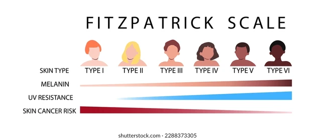

# Fitzpatrick Classification Skin Tone Detector (Web App)

This project is a browser-based application that detects a user’s face in real-time and classifies their skin tone according to the **Fitzpatrick Skin Type Scale**.  
Built using **HTML5**, **JavaScript**, **CSS**, and **MediaPipe FaceMesh**, the app provides a lightweight, fast, and privacy-first solution — all running entirely inside your browser.

## Table of Contents

- [About](#about)
- [Fitzpatrick Scale](#fitzpatrick-scale)
- [How It Works](#how-it-works)
- [Technologies Used](#technologies-used)
- [Installation and Setup](#installation-and-setup)
- [Usage](#usage)
- [Future Improvements](#future-improvements)
- [License](#license)

## About

The Fitzpatrick scale is used to classify skin types according to their response to ultraviolet (UV) light.  
This web app helps you analyze your skin tone live using your webcam and classifies it instantly.

✅ Lightweight and runs entirely in the browser  
✅ No backend server needed  
✅ Privacy-first: no data is sent anywhere  

## Fitzpatrick Scale


| Type | Description |
|:----:|:------------|
| I    | Very fair skin, always burns, never tans |
| II   | Fair skin, burns easily, tans poorly |
| III  | Medium skin, burns moderately, tans uniformly |
| IV   | Olive skin, rarely burns, tans easily |
| V    | Brown skin, very rarely burns, tans very easily |
| VI   | Dark brown or black skin, never burns |

## How It Works

- The webcam feed is captured.
- Face landmarks are detected using **Mediapipe's Face Mesh model**.
- Specific points on the face are sampled for color information.
- Based on the **average brightness** of these sampled pixels, the app classifies your skin tone into the appropriate **Fitzpatrick type**.

> All processing happens locally — no data leaves your device.

## Technologies Used

- **HTML5** and **CSS3** (Frontend design and layout)
- **JavaScript ES6+** (Application logic)
- **MediaPipe FaceMesh** (Real-time face landmark detection)
- **Camera Utils** (Webcam stream handling)

## Installation and Setup

1. Clone the repository:
   ```bash
   git clone https://github.com/likhithgujjar/fitzpatrick-skin-tone-detector-web.git
   cd fitzpatrick-skin-tone-detector-web
   ```

2. Open the `index.html` file directly in your browser (preferably **Google Chrome**).

_No external setup required!_

## Usage

- Open the web app.
- Grant permission to access the camera.
- Align your face inside the green dashed box.
- Tap **📸 Capture** to detect your skin tone.
- Tap **🔄 Retake** to try again.

> Tip: Ensure good lighting for better accuracy!


## Future Improvements

- Improve color sampling for better accuracy.
- Make the UI fully mobile-responsive.
- Add support for multiple faces.
- Deploy the app online using GitHub Pages or Vercel.

## License

This project is licensed under the [MIT License](LICENSE).
